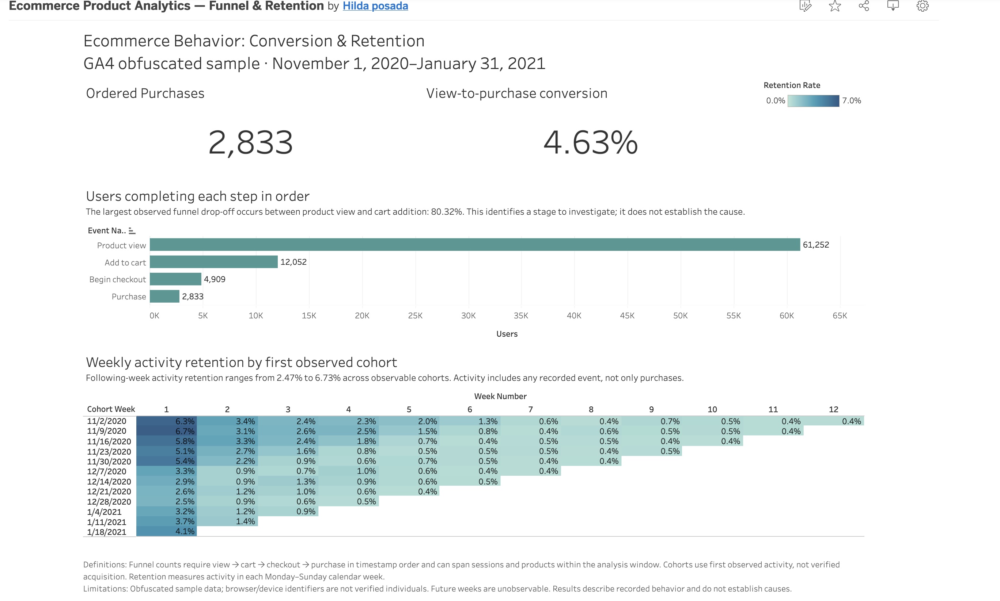

# Ecommerce Product Analytics

Portfolio analysis of GA4 ecommerce events: event quality, ordered conversion funnels, and weekly user retention.

## Dashboard

[Open the interactive Tableau Public dashboard](https://public.tableau.com/views/EcommerceProductAnalyticsFunnelRetention/ConversionRetention).

The dashboard uses Google's obfuscated GA4 ecommerce sample for November 1, 2020 through January 31, 2021. Treat the results as a methods demonstration, not a commercial recommendation.

## Key results

- Ordered funnel: 61,252 product viewers, 12,052 users adding to cart, 4,909 reaching checkout, and 2,833 purchasers.
- View-to-purchase conversion: 4.63%.
- Largest observed step drop-off: product view to add to cart (80.32%). This identifies a stage to investigate, not the cause.
- Following-week activity retention: 2.47% to 6.73% across observable cohorts. Activity includes any recorded event, not only purchases.

## Project files

- `sql/`: four BigQuery GoogleSQL analyses.
- `data/exports/`: aggregate CSV outputs from those queries.
- `dashboard/`: Tableau build notes and dashboard screenshot.
- `docs/`: event definitions and the cross-tool validation protocol.

## Reproduce the analysis

1. Open [BigQuery](https://console.cloud.google.com/bigquery), select or create a project, and use the [BigQuery sandbox](https://docs.cloud.google.com/bigquery/docs/sandbox) if needed. Set the query dialect to GoogleSQL and location to US.
2. Run `sql/01_event_audit.sql` first and review the estimated bytes before execution. Run each remaining SQL file separately.
3. Export aggregate query results to `data/exports/` using the matching CSV filenames. Do not add raw events, credentials, or personal data to the repository.
4. Connect each CSV separately in Tableau; see `dashboard/README.md` for the view setup and metric caveats.
5. Use `docs/validation_protocol.md` to reconcile outputs against an independent implementation before claiming cross-tool validation.

## Metric definitions

- Identity: non-null `user_pseudo_id`, a browser/device identifier and not a verified person.
- Unordered funnel: distinct users independently performing each event.
- Ordered funnel: first observed view, then earliest cart strictly after that view, earliest checkout strictly after cart, and earliest purchase strictly after checkout. The path can span sessions and products across the analysis window; equal timestamps do not establish order.
- Retention: first-observed activity week, followed by any activity in later Monday-to-Sunday calendar weeks. This is not acquisition or rolling seven-day retention.
- Retention cohorts are reported only for fully observable weeks.

## Sources and limitations

- [GA4 sample dataset](https://developers.google.com/analytics/bigquery/web-ecommerce-demo-dataset)
- [BigQuery sandbox](https://docs.cloud.google.com/bigquery/docs/sandbox)

The sample is obfuscated and covers only three months. Timestamp order can differ from reporting-date boundaries; missing identities, timestamp ties, repeat events, and finite observation affect interpretation. The sandbox tables can expire, so retain the SQL and aggregate exports. Cross-tool reconciliation is pending.
