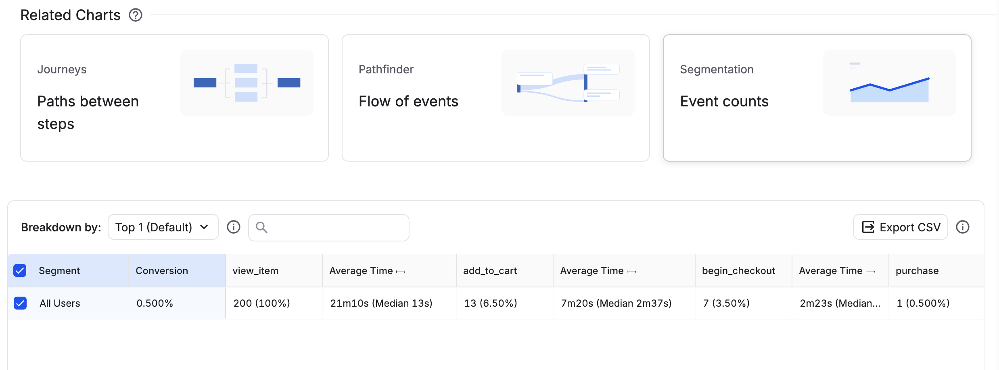

# Ecommerce conversion, retention, and event validation

## Business questions

Where do observed users drop out of the ecommerce purchase journey, how often do cohorts return, and can the same event-level funnel be reproduced across a warehouse, a product analytics platform, and a tested transformation pipeline?

The analysis uses Google's public obfuscated GA4 ecommerce sample from November 1, 2020 through January 31, 2021. The purpose is to demonstrate a reproducible analytical method. The sample does not justify recommendations about an actual merchant's current performance.

## Approach and metric definitions

BigQuery SQL audited events and produced aggregate funnel and retention outputs. Tableau Public presents those outputs in an ordered funnel and weekly retention heatmap. The [event dictionary](event_dictionary.md), [SQL](../sql/), and [dashboard](https://public.tableau.com/views/EcommerceProductAnalyticsFunnelRetention/ConversionRetention) preserve the definitions and implementation.

The dashboard counts distinct non-null browser/device identifiers. Its ordered funnel anchors on the first observed `view_item`, followed by the earliest `add_to_cart`, `begin_checkout`, and `purchase` strictly after the preceding step, across the analysis window. Events can span sessions and products. Equal timestamps do not establish order. This is a user journey measure, not an item-level attribution model.

Retention cohorts use each identifier's first observed activity week. A return means any recorded activity in a later Monday-to-Sunday calendar week. Only fully observable weeks are compared. First observation is not proven acquisition, and activity retention is not purchase retention.

## Findings

| Ordered step | Users | Conversion from previous step |
|---|---:|---:|
| Product view | 61,252 | — |
| Add to cart | 12,052 | 19.68% |
| Begin checkout | 4,909 | 40.73% |
| Purchase | 2,833 | 57.71% |

View-to-purchase conversion is **4.63%**. The largest observed loss is view to cart: **49,200 identifiers, or 80.32%** of viewers. This locates a stage for investigation; it does not explain why users left. Product mix, browsing intent, availability, device experience, and instrumentation could all affect the result.

Following-week activity retention ranges from **2.47% to 6.73%** across cohorts with an observable next week. These rates describe return activity in this sample. They do not establish long-term customer loyalty or the effect of a product change. The [aggregate exports](../data/exports/) support both sets of findings.

## Independent event-level validation

To test consistency beyond dashboard formatting, a deterministic 200-user extract retained 1,353 events across the four funnel event types. The same hashed identities and event rows were used in BigQuery and Amplitude. The comparison used unique users, strictly ordered steps, epoch-millisecond precision, and seven elapsed days with an exclusive upper bound. It allowed any qualifying entry path within the available extract.

| Step | BigQuery | Amplitude | Difference |
|---|---:|---:|---:|
| Product view | 200 | 200 | 0 |
| Add to cart | 13 | 13 | 0 |
| Begin checkout | 7 | 7 | 0 |
| Purchase | 1 | 1 | 0 |

All four counts matched. Amplitude's chart history limit prevented the original 2020 dates from being charted, so both tools used a clearly labeled copy shifted by the identical constant offset of 181,353,600,000 milliseconds into August 2026. Original timestamps were retained; elapsed durations and ordering were preserved. The rebased dates are an experimental accommodation, not real 2026 business activity.

This sample comparison has different scope and entry rules from the full-population dashboard. Its 200 → 13 → 7 → 1 counts should not be equated with the Tableau counts. The [validation results](validation_results.md) document the shared rules, import receipts, screenshots, and limitations.

## Tested dbt implementation

A local DuckDB dbt project models the same original validation extract through `stg_events`, `int_funnel_paths`, and `fct_funnel`. The staging model preserves source rows and normalizes timestamp precision. The path model builds successive events, and the final model counts distinct users by completed step.

A real `dbt build` loaded the 1,353-row seed, created three table models, and passed 14 data tests. Its funnel reproduced **200 → 13 → 7 → 1**. Tests cover required fields, unique source event identifiers, accepted event names, sample coverage, independent baseline counts, monotonicity, timestamp ordering, and conversion-window bounds.

The adversarial fixture also tests ties, wrong order, later entries, and the deadline. Moving a purchase to 604799999 milliseconds after entry while retaining a stale expected step of three returned one failing row: the actual completed step was four. Correcting the expectation restored a passing build. A separate purchase exactly at 604800000 milliseconds remains excluded. This demonstrates how returning unexpected rows makes a dbt data test fail.

[Build results](../evidence/dbt_build_summary.json), [passing log](../evidence/dbt_build_output.txt), [intentional failure log](../evidence/dbt_boundary_failure.txt), and [screenshot](../evidence/dbt-build.jpg) record the execution. Documentation was generated and served locally. The project also ran in **BigQuery**, materializing the three models in `ecommerce_validation` and passing the same 14 tests. Querying the warehouse funnel returned **200 → 13 → 7 → 1**. BigQuery uses the existing validated source table and skips the local seed. [Warehouse execution evidence](../evidence/dbt_bigquery_summary.json) and [build log](../evidence/dbt_bigquery_build_output.txt) confirm the run. The synthetic fixture and one reserved alias were made portable; the DuckDB build also passed again. dbt Fundamentals certification is in progress and is not claimed complete.

## Limitations and next investigation

The data is obfuscated, observation is finite, identifiers are not verified people, and timestamps can tie. The full dashboard funnel can span products and sessions. The validation extract ends seven days after each user's first view, which can censor later entry paths. One purchaser in the sample provides little evidence about commercial performance.

Agreement between tools confirms the tested calculation under shared rules. It does not prove that source collection is complete, identities are correct, or the funnel reflects causality. Amplitude accepted the imported rows, but a full raw-event re-export reconciliation has not been performed.

Next analytical work would segment the view-to-cart loss by device, traffic source, and product where data permits; compare session- and item-level paths; audit timestamp ties and missing events; and investigate retention with longer observation. Any proposed product intervention should be evaluated with an appropriate experiment rather than inferred from funnel drop-off alone.

## Portfolio status

The published Tableau dashboard, BigQuery–Amplitude sample comparison, local dbt execution, and this case study are complete. dbt Fundamentals certification is in progress. BigQuery dbt execution is complete. The resume wording below is a draft for the learner to add to their resume; an actual resume has not been edited.
