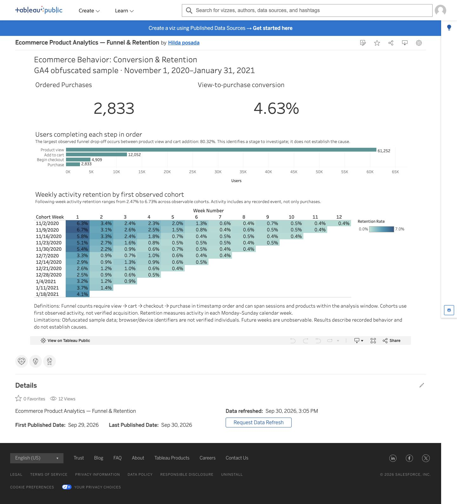
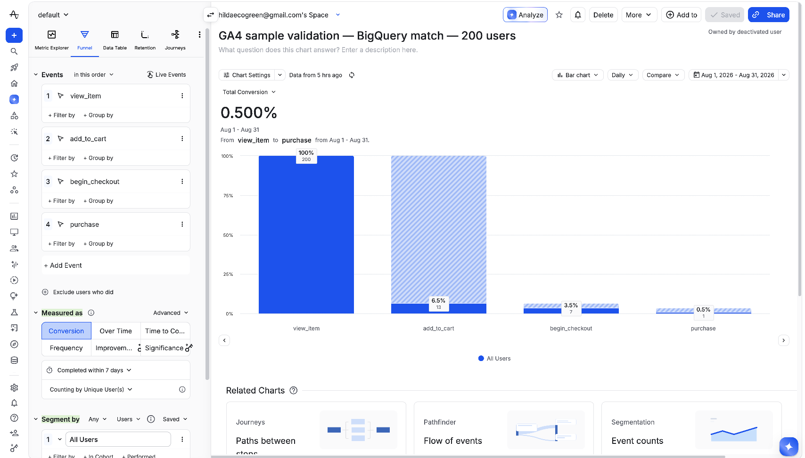

# The Story Behind This Repo

## The question

If a website tracks what visitors do, can you trust the numbers two different tools report about the same visitors?

I wanted to check that with actual event data. I built a purchase funnel, then used a second tool to check the same calculation independently.

## What the dashboard shows

In the full sample, **61,252 visitor IDs viewed a product and 2,833 completed the purchase journey**. That is a **4.63% view-to-purchase rate**.

The journey had four steps, completed in this order:

| Step | Visitor IDs |
|---|---:|
| Viewed a product | 61,252 |
| Added to cart | 12,052 |
| Started checkout | 4,909 |
| Purchased | 2,833 |

The biggest drop was from viewing a product to adding it to a cart. **80.32% of viewers did not reach the cart step in this ordered journey.** That gives an analyst a place to start asking questions. It does not explain why visitors left.

The dashboard also tracks return activity by week. Between **2.47% and 6.73%** of visitor IDs in the eligible weekly groups returned the following week. A return means any recorded activity, not necessarily another purchase.

[Open the interactive Tableau dashboard](https://public.tableau.com/views/EcommerceProductAnalyticsFunnelRetention/ConversionRetention).

## The data

I used Google's public GA4 ecommerce sample from November 2020 through January 2021. Google has obscured parts of this data to protect the source business.

The counts use browser or device identifiers. I call them visitor IDs because one identifier does not prove one person. The journey can also span sessions and products, so it is not a measure of one item moving through one shopping session.

## Checking whether the tools agree

For the independent check, I selected **200 visitor IDs and 1,353 events**. I used the exact same extract in BigQuery, where I counted the journey with SQL, and Amplitude, where I configured a funnel chart.

Both tools counted unique visitor IDs. Both required the four steps in order, with seven elapsed days to complete the journey. I matched the identities, event names, timestamp precision, and counting rules.

I hit a problem before I could compare the results. Amplitude accepted the historical events, but the project's plan would not display a chart for 2020.

I shifted every timestamp forward by the same amount in both tools. It was like sliding the whole calendar forward together. The dates changed, but event order and time between events stayed the same. I retained the original timestamps alongside the shifted ones and labeled the shifted copy as a validation experiment.

After that, both tools returned **200 → 13 → 7 → 1**. Every step matched, with zero difference.

Those shifted dates do not represent real activity in August 2026. They let me check the method without buying a plan upgrade.

## An automated check

I then built a small transformation pipeline with dbt. It turns the event rows into the same ordered journey and checks for missing fields, duplicate event IDs, unexpected event names, incorrect ordering, and events outside the conversion window.

The pipeline has **three models and 14 tests**. It ran successfully on both **BigQuery and a local database called DuckDB**. BigQuery's final table returned the same **200 → 13 → 7 → 1** counts.

I also tested whether a failure would be caught. In a synthetic example, a purchase exactly at the seven-day deadline should be excluded. I moved it one millisecond earlier but left the expected result unchanged. The test returned one unexpected row and failed. Correcting the expectation made it pass. I kept a separate example at the exact deadline to check that it still stays excluded.

The passing build and the deliberate failure are saved in the repository. They show what ran and what the tests caught.

## The limits

The 200-ID comparison checks a method on a small sample. It is not a business conclusion about the full population. Its entry rules and observation window also differ from the full dashboard, so the two sets of counts should not be treated as interchangeable.

The data covers three months, uses browser or device IDs, and has been obscured. Later journeys in the extract may have less than seven days of follow-up. Matching counts does not prove every event was collected correctly. I have not reconciled a full raw-event export from Amplitude.

**dbt Fundamentals certification is in progress.** The implemented pipeline has run on BigQuery and DuckDB, but this is a portfolio exercise, not a production deployment.

## Why I built this

I wanted evidence that I can turn event data into a useful analysis and check the result independently.

The next business question would be why so many viewers do not reach the cart step. I would look at device experience, traffic source, product availability, and browsing intent where the data supports it. The funnel tells me where to investigate. More evidence is needed to explain the cause or recommend a change.

## Want the details?

- [Validation rules, results, and limitations](validation_results.md)
- [Event definitions](event_dictionary.md)
- [BigQuery SQL](../sql/)
- [dbt models and reproduction instructions](../dbt/README.md)
- [Actual BigQuery dbt build output](../evidence/dbt_bigquery_build_output.txt)
- [The intentional test failure](../evidence/dbt_boundary_failure.txt)
- [Resume project wording](resume_project.md)
