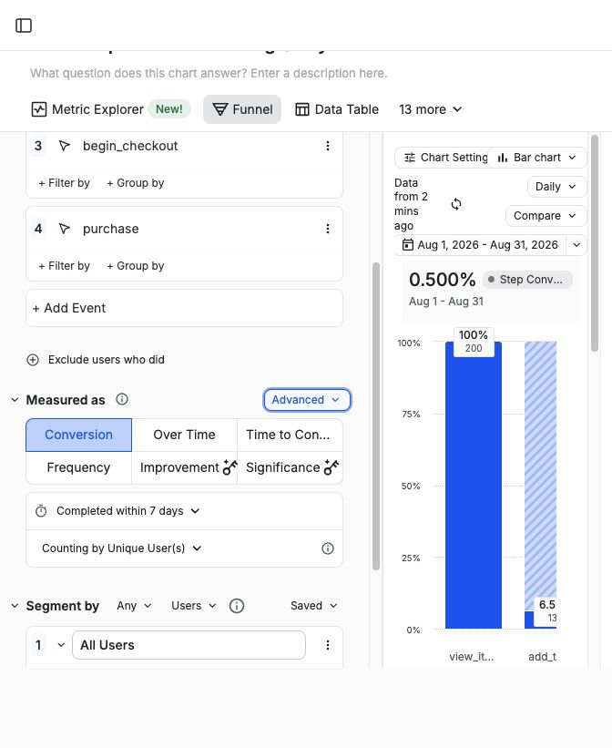
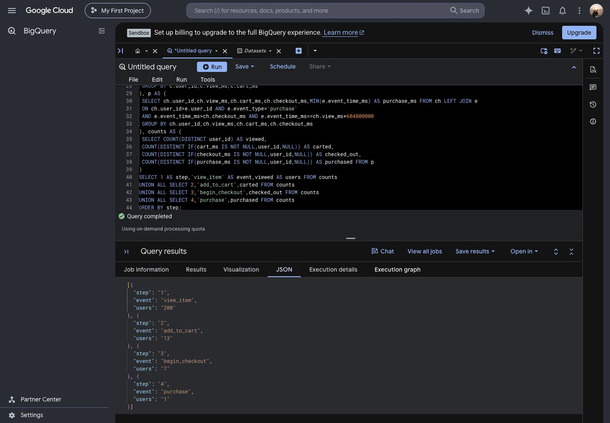

# BigQuery–Amplitude event-level validation

Completed September 30, 2026. One matching funnel was measured from a shared event-level extract, not the Tableau aggregate CSVs.

## Question and shared rules

Can the same four-event ordered funnel produce identical unique-user counts in SQL and Amplitude?

- Source: Google's public obfuscated GA4 ecommerce sample; `sql/05_mixpanel_validation_extract.sql` deterministically selects 200 users by FARM_FINGERPRINT of source identity. Users first view an item in November 2020 UTC; all four funnel-event types in the seven days after that first view are retained. This is a bounded validation sample, not an estimate of the full population.
- Identity: the same `ga4_` plus SHA-256 user ID in both tools. No identity stitching or session restriction. Browser/device identifiers do not establish distinct people.
- Events: `view_item` → `add_to_cart` → `begin_checkout` → `purchase`, in this order; intervening/repeated events are allowed. Count unique users with any qualifying entry path, not event totals.
- Conversion window: seven elapsed 24-hour days from each qualifying view. Entries: August 1–31, 2026 UTC in the rebased copy. All available continuation events are retained.
- Precision: epoch milliseconds in both tools; Amplitude Advanced → Millisecond resolution enabled. Original microseconds are retained in a provenance property/column. SQL uses strict `>` between steps; exact millisecond ties do not establish order. No difference was observed for this sample.
- Deduplication: the original extract has 1,353 unique source event IDs, no null required fields. Amplitude `insert_id` is `rebased_v2_` plus source event ID. Do not re-import under different IDs.

## Plan limitation and timestamp transformation

Amplitude accepted the original historical batch (1,353 events) but its chart displayed “Date Range Exceeds Plan Limit” for 2020. The plan exposes one year of chart history. Rather than purchasing an upgrade, this experiment uses a second, clearly labeled batch.

Every original timestamp was shifted by exactly 181,353,600,000 ms: November 1, 2020 maps to August 1, 2026. The same rebased rows were ingested in Amplitude and materialized in BigQuery. This constant shift preserves ordering and all elapsed durations. Source timestamps remain in `source_event_time_ms` / `source_event_timestamp_us` and event properties. No timestamps were independently randomized or set to upload time.

This is a methods validation using rebased historical sample data, not a statement about August 2026 business performance. The original Tableau dashboard retains its real 2020–2021 dates.

## Evidence and results

Both Amplitude imports returned HTTP 200 and `events_ingested: 1353`. BigQuery materialized the identical original rows and the rebased copy. Local independent reconstruction also returned the same funnel.

| Funnel step | BigQuery | Amplitude | Difference |
|---|---:|---:|---:|
| view_item | 200 | 200 | 0 |
| add_to_cart | 13 | 13 | 0 |
| begin_checkout | 7 | 7 | 0 |
| purchase | 1 | 1 | 0 |

Conversion from view is 6.5%, 3.5%, and 0.5% at successive steps. All four step counts agree exactly. No unexplained funnel discrepancy remains in this sample.

Checksums, event counts, source coverage, table names, and chart URL are recorded in `evidence/validation_manifest.json`. Import receipts and comparison CSV are in `evidence/`. Raw event extracts and API keys are deliberately excluded from this repository.

## Reproduce

1. Run the source extraction SQL in BigQuery US and export the CSV locally. Confirm the manifest counts/checksum before using it.
2. Convert epoch microseconds to milliseconds with integer division by 1,000; retain originals. Load exactly these rows into `ecommerce_validation.events_200_users_v1`.
3. Run `sql/07_amplitude_matching_funnel.sql` for the historical copy. Run `sql/08_rebase_validation_dates.sql` then `sql/09_rebased_matching_funnel.sql` for the plan-compatible copy. Replace project/table identifiers for your own environment.
4. Import the same rebased rows via Amplitude's Batch Event Upload API, keeping user_id, event_type, time, and deterministic insert_id. Supply your project ingestion key outside source control.
5. Configure in-this-order, unique users, seven days, UTC, August 1–31 2026, millisecond resolution. Compare all four counts and archive evidence. Restrict event steps to the validation batch if other same-date events are later added to the project.

## Limits and next investigation

This validates only the bounded sample and shared seven-day rules. Tableau uses the full November–January population and a full-window, first-view anchored funnel; its 61,252 → 12,052 → 4,909 → 2,833 counts are not expected to match this sample. The sample's one purchaser provides weak evidence about commercial performance.

The extract excludes events after seven days from first view, so later repeat entries can have shorter observable follow-up. This limits interpretation but is shared in both tools. Exact agreement does not prove missing source events, identity correctness, or causal explanations. Amplitude row acceptance and funnel matching are demonstrated; a full raw-event re-export reconciliation has not been performed.

Next: implement a small dbt staging model with not-null, uniqueness, accepted-event, and timestamp/sequence tests; then write a case study distinguishing the full-population Tableau findings from this validation experiment.

## Official references

- [GA4 public ecommerce sample](https://developers.google.com/analytics/bigquery/web-ecommerce-demo-dataset)
- [Amplitude Batch Event Upload API](https://amplitude.com/docs/apis/analytics/batch-event-upload)
- [Funnel conversion windows](https://amplitude.com/docs/analytics/charts/funnel-analysis/funnel-analysis-interpret)
- [Millisecond resolution and simultaneous events](https://amplitude.com/docs/analytics/charts/funnel-analysis/funnel-analysis-how-amplitude-handles-simultaneous-events)
